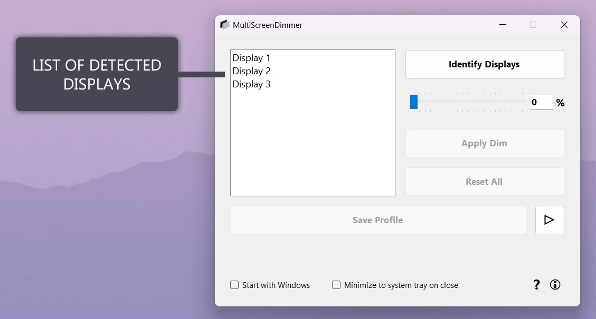
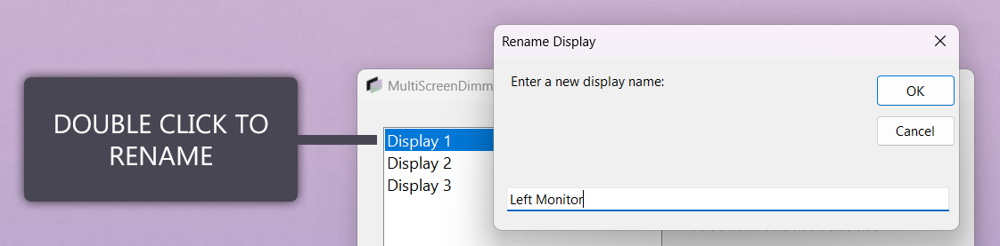
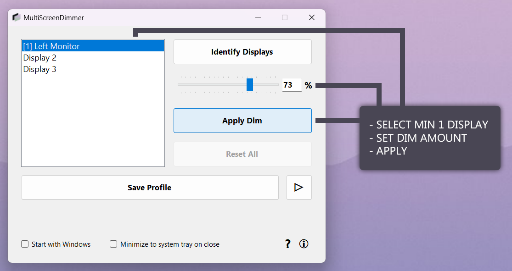
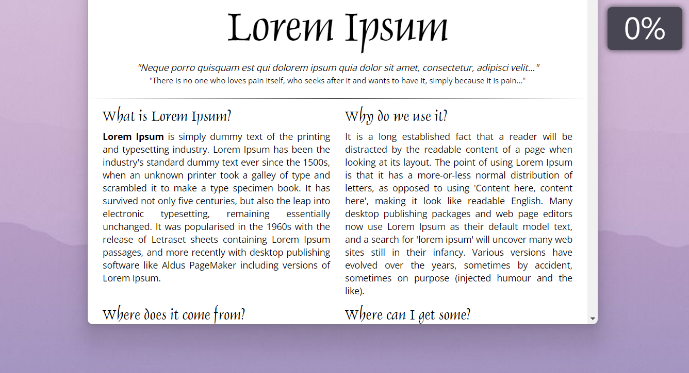
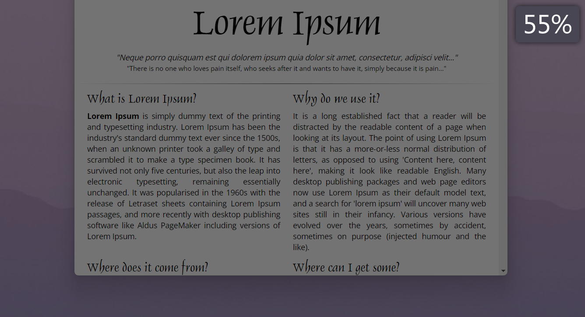
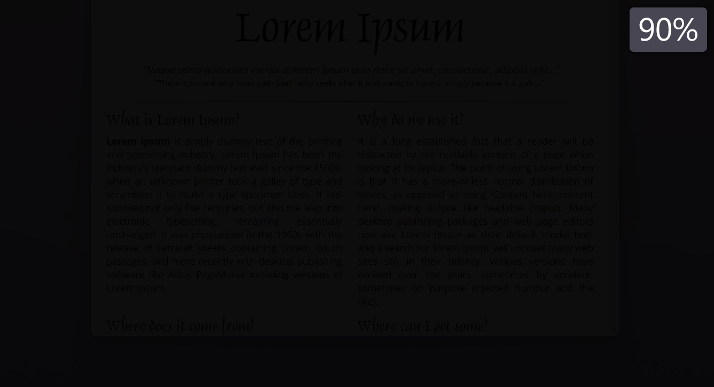
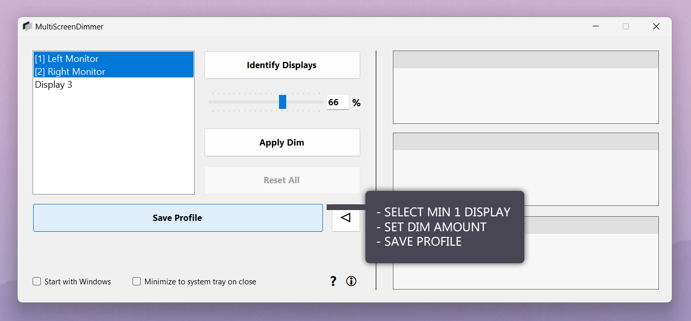
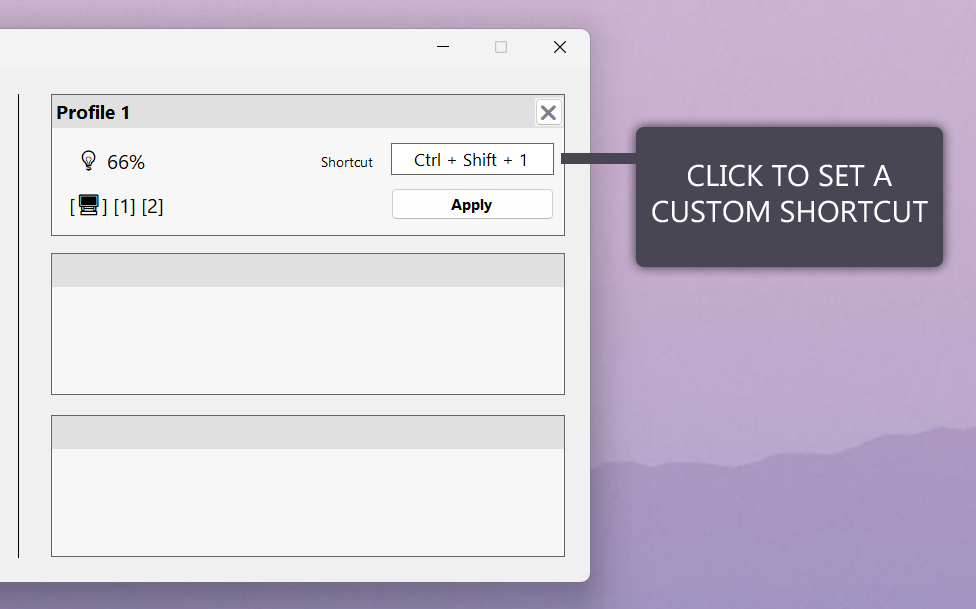
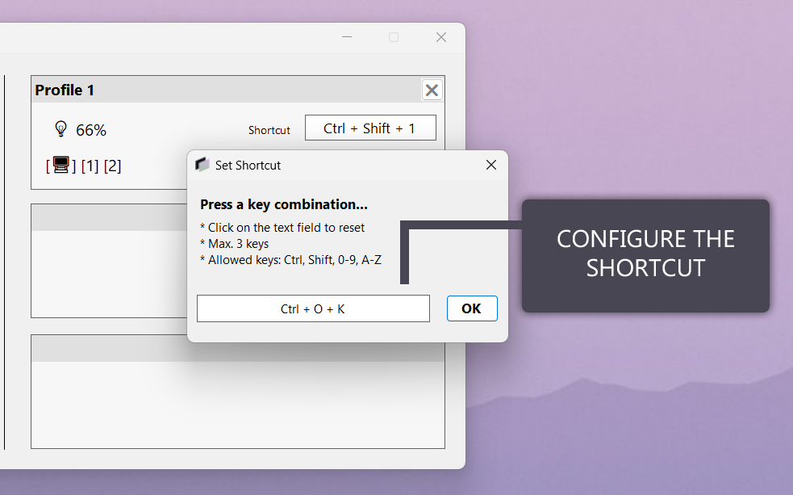
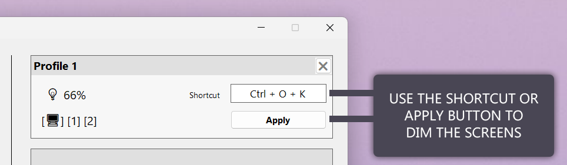

# MultiScreenDimmer

Copyright (c) 2024 **Mehmet Melih Solt**

## Description

**MultiScreenDimmer** is a handy tool designed to simplify adjusting the brightness of multi-monitor setups. Created out of a personal need for easier brightness control across multiple screens, this tool allows users to dim specific monitors quickly with just a click or a customizable shortcut. This app achieves its dimming effect by creating a black screen overlay on top of everything, allowing users to achieve a darker display than default brightness settings.

You can save **profiles** to tailor dimming settings for different scenarios, whether you're watching content on your main monitor, gaming, or simply want to focus on a particular screen. With MultiScreenDimmer, managing the brightness of your multi-monitor setup becomes a convenient and effortless task.

## Features

- Easily adjust brightness levels across multiple monitors
- Simple interface for quick dimming
- Save profiles for different scenarios
- Customizable shortcuts
- Ideal for users with multi-monitor setups
- Open-source and freely available

## Requirements

- **Windows Operating System**: The application is compatible with Windows operating systems.
- **.NET Runtime**: Make sure you have the .NET 8.0 runtime installed on your system. You can download it from the official [.NET Download](https://dotnet.microsoft.com/download) page.

## Screenshots (How to Use)

## License

This project is licensed under the MIT License - see the [LICENSE.md](LICENSE.md) file for details.

## Download

The latest release of MultiScreenDimmer can be downloaded from the [Releases](https://github.com/realredjohn/MultiScreenDimmer/releases) section.

## Feedback

If you have any questions, feedback, or suggestions, feel free to reach out!
